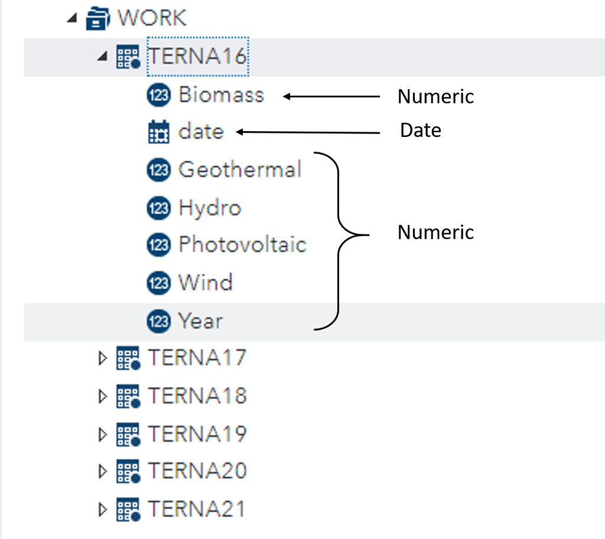

--- 
layout: default
title: Basics of data manipulation
subtitle: Learn about different SAS functions to implement in the data step.
--- 

## Learning Objectives 

* Properly format the variables before modifying them 

* Explore the DATA step and its group of statements in detail, in particular how to modify variables, have control over their execution and create calculated fields

* Compare the use of DATA step statements in CAS

* Learn about different options to control the output for the entire dataset, for only certain observations and / or variables

## Structure 

<a href="#sect1">1. Observational analyses</a>

<a href="#subsect1">Familiarise with the dataset</a>

<a href="#subsect2">Format the data</a>

<a href="#subsect3">Quick summary statistics</a>

<a href="#sect2">3. Data manipulation </a>

<a href="#subsect4">Cleaning and sorting</a>

<a href="#subsect5">Feature engineering</a>

<a href="#subsect6">Save your new dataset!</a>

<a href="#sect3">4. Resources</a>

# 1. Observational analyses

Every data scientist has a specific workflow to carry out a project: importing, cleaning, analysing dataset(s) and presenting an output, usually through a visual medium. **80% of our work consists of cleaning and preparing the datasets for analysis and modelling**. As you can imagine, raw datasets come in all shapes and forms, and that is way it takes way more time and effort to clean them, sort them, create new variables, than carrying out the analysis and reporting. 

**In this tutorial we are going to learn how to carry out some basic data manipulation with SAS.**

## Familiarise with the dataset

Once you have your data imported on your programming interface, the first thing you need to do is to familiarise with the dataset or series of datasets you are working with. 

You should have your datasets uploaded and imported on SAS 
Studio. If you haven't got them yet, you can download them 
by clicking on the button below. 

    <form action="AD">
        <a href="/terna_data/terna_data.zip"><input type="button" value="DOWNLOAD THE FILE"></a>
    </form>

You should first extract the files within the zip folder, then upload them on SAS Studio. The files come in three formats, and you might want to check out the tutorial on [data access](/tutorials/accessing_data.html), to learn how to **import them on SAS Studio**. Once you've done that, you can come back here to start this tutorial!

## Format the data

Before getting to the actual manipulation of the datasets, you always need to **observe the characteristics of the variables and observations inside each dataset**. 

This way, you can start getting a general **overview** of them, and see if any **formatting changes** need to be made. 

We know that variables can be formatted as either of these three ways:  

1. Numeric 
2. Character string 
3. Datetime

SAS reads *numeric data* by default. However, it is necessary to **add specifications** to make SAS read particular types of **numerical** data as well as **other data formats** (or *types*). 

I am going to assume you have the 6 datasets uploaded and imported as SAS files on your SAS Studio. 

You can make sure that all datasets have been temporarily stored inside the *work* library, with the name you've given. I have called the datasets *ternaN* where N stands for the years 2016 until 2021 (the most recent observation). 

Once you've headed to the library, you can also check the content of each dataset. For instance, open the dropdown menu from Terna16. 

Each variable is accompanied by a symbol which already **gives you information on the format of the variable**. You can see most variables are numeric except *date*, which is datetime format. 

We can also quickly explore the datasets by executing two procedures: **proc contents** and **proc print**. 

Copy the following in a new SAS program (call the program *tutorial_basic_manip.sas*, if you wish to keep it in the future). 

### Formats and informats 

### Numeric formatting 

### String formatting 

### Datetime formatting 

## Quick summary statistics

# 3. Data manipulation 

## Cleaning and sorting 

## Feature engineering 

## Save your new dataset!

# 4. Resources 

