--- 
layout: default
title: Basics of data manipulation
subtitle: Learn about different SAS functions to implement in the data step.
--- 

## Learning Objectives 

* Properly format the variables before modifying them 

* Explore the DATA step and its group of statements in detail, in particular how to modify variables, have control over their execution and create calculated fields

* Compare the use of DATA step statements in CAS

* Learn about different options to control the output for the entire dataset, for only certain observations and / or variables

## Structure 

<a href="#sect1">1. Familiarise with the dataset</a>

<a href="#subsect1"><sub>PROC CONTENTS</sub></a>

<a href="#subsect2"><sub>PROC PRINT</sub></a>

<a href="#sect2">2. Data formatting</a>

<a href="#subsect3"><sub>FORMAT and INFORMAT in the DATA STEP</sub></a>

<a href="#subsect4"><sub>PROC FORMAT</sub></a>

<a href="#sect3"> 3. Features and manipulations

<a href="#subsect5"><sub>Feature engineering</sub></a>

<a href="#subsect6"><sub>Join datasets</sub></a>

<a href="#sect4">4. Save your new dataset!</a>

<a href="#sect5">5. Exercises and extras</a>

<a href="#sect6">6. Resources</a>


<a name="sect1"></a>

# 1. Familiarise with the dataset

Every data scientist has a specific workflow to carry out a project: importing, cleaning, analysing dataset(s) and presenting an output, usually through a visual medium. **80% of our work consists of cleaning and preparing the datasets for analysis and modelling**. As you can imagine, raw datasets come in all shapes and forms, and that is way it takes way more time and effort to clean them, sort them, create new variables, than carrying out the analysis and reporting. 


**In this tutorial we are going to learn how to carry out some basic data manipulation with SAS.**

Once you have your data imported on your programming interface, the first thing you need to do is to familiarise with the dataset or series of datasets you are working with. 

You should have your datasets uploaded and imported on SAS 
Studio. If you haven't got them yet, you can download them 
by clicking on the button below. 

<center>
    <form action="AD">
        <a href="/terna_data/terna_data.zip"><input type="button" value="DOWNLOAD THE FILE"></a>
    </form>
</center>

You should first extract the files within the zip folder, then upload them on SAS Studio. The files come in three formats, and you might want to check out the tutorial on [data access](/tutorials/accessing_data.html), to learn how to **import them on SAS Studio**.

You can make sure that all datasets have been temporarily stored inside the *work* library, with the name you've given. I have called the datasets *ternaN* where N stands for the years 2016 until 2021 (the most recent observation). 


For this tutorial, we are going to work with terna16, and at the end with terna17. 

Once you've headed to the library, you can also check the content of each dataset. For instance, terna16.


Each variable is accompanied by a symbol which already **gives you information on the format of the variable**. You can see most variables are numeric except *date*, which is datetime format. 

We can also quickly explore the datasets by executing two procedures: **proc contents** and **proc print**. 

<a name="subsect1"></a>

## PROC CONTENTS 

Copy the following in a new SAS program (call the program *tutorial_basic_manip.sas*, if you wish to keep it in the future). 

```
/*Executing proc contents on terna16*/

proc contents data=work.terna16;
run;
```

We want to know **information on the contents** of the dataset called *terna16*, which we are going to work with throughout this tutorial.


The proc contents statement gives us a nice overview about the dataset. We are provided with three tables, which you've already explore in the [data access](accessing_data.html) tutorial. 
 
* **dataset description**, including: dataset name and the library it is contained within, n of observations, of variables and the maximum length allowed for a data value; 
* **Engine/host dependent information**: information about how SAS Studio stores and outputs the dataset; 
* **Alphabetic List of Variables and Attributes**: as the title explains, it gives a more in depth overview of the variables contained inside the dataset. 

#### Customise the output

There are a variety of options available for you to customise the output of the procedure. 

Here is the list of available options: 

| Option | Description |
|:---: | :---: |
| CENTILES | Prints centiles information for indexed variables |
| DATA = | Specifies the input dataset |
| DETAILS / NODETAILS | Sets whether to include information in the output about the number of observations, number of variables and dataset *labels* |
| DIRECTORY | Prints a list of SAS files in the SAS data library |
| FMTLEN | Prints the length of the variable's informat or format |
| MEMTYPE = | Restricts processing to one or more types of a SAS file |
| NODS | Suppresses the printing of individual files |
| NOPRINT | Suppresses the printing of the output | 
| OUT = | Specifies the output dataset |
| OUT2 = | Specifies an output dataset that contains information about constraints |
| SHORT | Prints an abbreviated output |
| VARNUM | Prints a list of the variables by their logical position in the dataset |

Let's see some of them. 

##### Option #1: Directory 

You only need to add the *directory* option on the same line of the *proc contents* statement: 

```
proc contents data=work.terna16 directory;
run;
```

You will see that before the proc contents output we saw before, other two tables appear storing information on the *directory*.

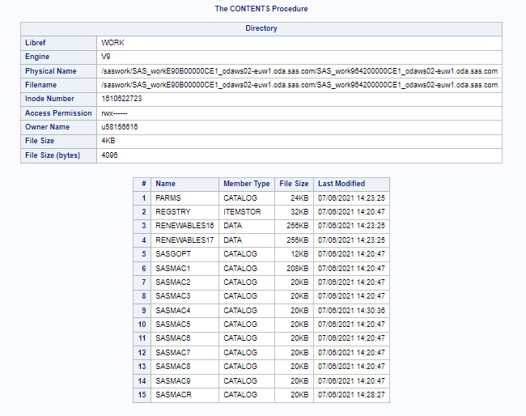

##### Option #2: Memtype

###### What are memtypes? 

*Memtypes* or *Member types* are all the files readable by SAS. These include data, views, catalogs and more. For more information on SAS files, extensions and member types check out this [link](https://v8doc.sas.com/sashtml/win/z1iles.htm).

If we add *memtype = catalog* next to the previous line of code, like so:

```
proc contents data=work.terna16 directory memtype=catalog;
run;
```

We are only going to see information of the directory filtered for catalog memtypes only.

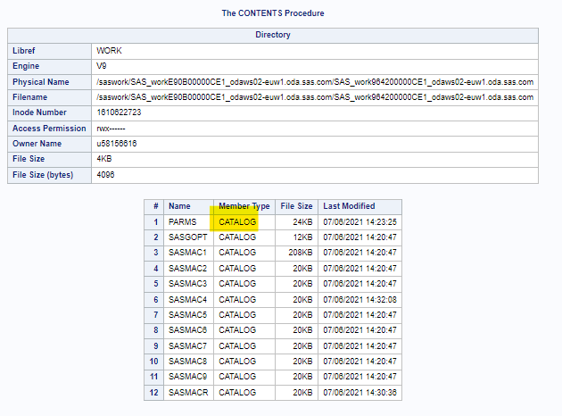

If we add *memtype = data* this time we are going to see information on the two datasets I have uploaded: terna16 and terna17. 

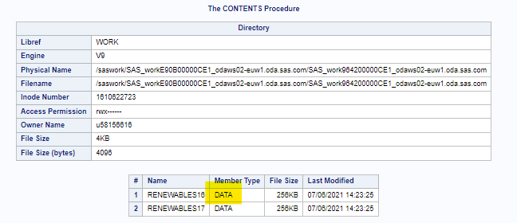

##### Option #3: Out

If you want to save the information from the proc contents into a dataset format, you need to use the *out* option, where you specify the name of the dataset, like so: 

```
proc contents data=work.terna16 directory memtype=data out=data_dir_info;
run;
```

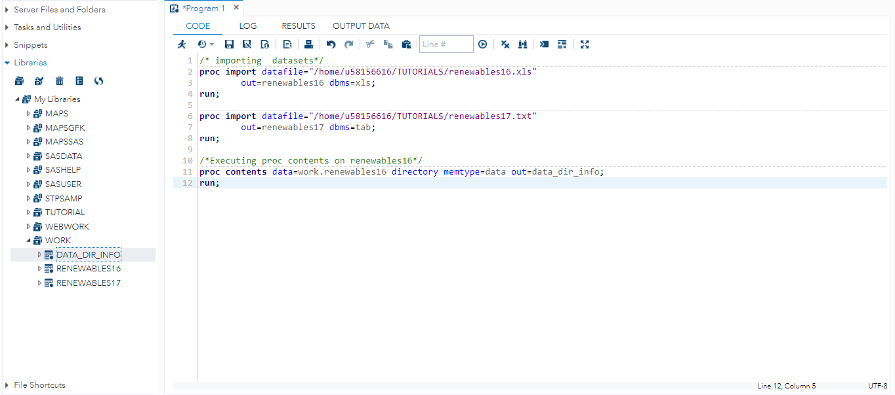

For more information and examples on the *contents procedure* click [here](https://documentation.sas.com/doc/en/pgmsascdc/9.4_3.5/proc/n1hqa4dk5tay0an15nrys1iwr5o2.htm).

<a name="subsect2"></a>

## PROC PRINT 

Another useful thing to do when getting to know the dataset is to print out its raw data. We do so with the [**PRINT procedure**]:

```
/* proc print */ 

proc print data=work.terna16; 
run; 
```

In the results tab you can see the whole dataset has been printed out. We could scroll down to see every single row of terna16, or we could just tell SAS to **print the top 10 and bottom 10 observations**, so as to have a broader and quicker look of it. Copy the following code:

```
/* First 10 obs */

proc print data = work.terna16 (obs = 10);
run;

/* Last 10 obs */

data last10;
  do p=max(1,nobs-9) to nobs;
    set work.terna16 nobs=nobs point=p;
    output;
  end;
  stop;
run;

proc print data = work.last10;
run;
```


<a name="sect2"></a>

# Data formatting 

Before getting to the actual manipulation of the datasets, you always need to **observe the characteristics of the variables and observations inside each dataset**. 

This way, you can start getting a general **overview** of them, and see if any **formatting changes** need to be made. 

We know that variables can be formatted as either of these three ways:  

1. Numeric 
2. Character string 
3. Datetime

SAS reads *numeric data* by default. However, it is necessary to **add specifications** to make SAS read particular types of **numerical** data as well as **other data formats** (or *types*). 

<a name="subsect3"></a>

## FORMAT and INFORMAT in the DATA STEP

Do you recall the concept of format and informat statements from [accessing data](tutorials/../accessing_data.html)?

Informats and formats present the same formatting specifications. However, **they are used for very different purposes**. The **informat** statement enables SAS to read a non-standard variable, while the **format** statement allows SAS to display the same variable when printed to the output window or viewed in a viewtable window. This implies that **before the format statement there always needs to be an informat**. In fact, printing an output without having *_in_formatted the data* first will not display anything because SAS has not been able to read and interpret it. 


The syntax does not vary between formats and informats, and it is generally presented as

**(IN)FORMAT*w.d***

where

* *(IN)FORMAT* represents the name of the format or informat; 
* *w.* refers to the **character** length to be specified, if not the default specific to that (in)format applies;
* *d* refers to the **number of decimal points to be included**. This is specific to the numeric format, and to some of the *date* formats and informats (in that case relating to *fraction of seconds*).
* **REMEMBER** that *informats* are not always necessary, they need to be used only in certain cases (when SAS cannot understand the original formatting type).

Let's explore examples of typical formats by **category**. We will then use some of them to better format our datasets. 

### Numeric (in)formatting 

This table summarises a few of the most common formats and informats used for numeric values.

| Syntax | Definition | Width range | Default width |
|:---:|:---:|:---:|:---:|
| *w.d* | Reads standard numeric data | 1-32 | None |
| BZ*w.d* | Converts blanks to 0s | 1-32 | 1 | 
| COMMA*w.d* | Removes embedded comma and/or $ , converts *left parenthesis* to a *minus sign* |1-32 | 1 | 
| PERCENT*w.* | Converts *percentage* to a *proportion* | 1-32 | 6 |
| DOLLAR*w.d* | Turns the number into *currency*, by inserting the *$* in front of the value | 2-32 | 6 | 
| WORDS*w.d* | Converts the numeric value to *written* (string) *format* | 5–32767 | 10 |

As you can see from running our last piece of code, the values in the datasets are mostly numeric, but present way too many decimals to be read easily. Some formatting is required. 

```
/* Numeric data formatting: setting number of decimal places */

data terna16_formatted; 
set work.terna16;
format Biomass 5.2 Wind 5.2 Geothermal 5.2 Hydro 5.2 Photovoltaic 5.2;
run;
```

Let's have a look at the code written. 

* There is a new statement: **set**, allowing you to create a new dataset from the copy of an already existing one. In our case, we have copied the dataset *terna16* to create a new one *terna16_formatted*, with the changes made on the format of the numeric variables.
* As we said earlier, in this case **we don't need to specify the informat** - SAS does recognise the numeric format, and the **format** statement is enough to change the number of decimal places. 
* To format the variables we have specified the *w.d* options mentioned before. The *w.* relates to the **total character length set for the value** which we set to 5, while the *d* refers to the number of decimal places allowed, or 2 in our case.

You can see the difference between the formatted numeric values and the original format below. 


Also check what happens if we only wrote an *informat statement*, instead of the format. 

```
/* Numeric data formatting: setting number of decimal places */

data terna16_formatted; 
set work.terna16;
informat Biomass 5.2 Wind 5.2 Geothermal 5.2 Hydro 5.2 Photovoltaic 5.2;
run;
```


What has changed? *Nothing*! **The informat does not work as it does not find any value to transform in order to make it compatible with SAS**. 

### Datetime (in)formatting 

This table shows a few common examples of (in)formatting types used for date-time values.

| Syntax | Definition | Width range | Default width |
|:---:|:---:|:---:|:---:|
| DATE*w.* | Reads dates in forms *ddmmyyyy* and *ddmmyy* | 7-32 | 7 | 
| DATETIME*w.* | Reads datetime values in the form: *ddmmyy hh:mm:ss:ss* | 13-40 | 18 |
| TIME*w.d* | Reads time in form: *hh:mm:ss:ss* (or *hh:mm*) using a 24-h clock | 5-32 | 8 |
| DDMMYY*w.* | Reads date values in the form *ddmmyy* or *ddmmyyyy* | 2-10 | 8 |
| MONYY*w.* | Reads month and yer date values in the form *mmmyy* or *mmmyyyy* | 5-7 | 5 |
| YYQ*w.* | Reads *quarters* of the year | 4-32 | 6 |

In our datasets, two are date-time variables: *year* and *date*. If you go back to the results from the PROC CONTENTS, you can see that the variable **date** is correctly seen as a date, formatted as *MMDDYY10.*, while **year** is considered a numeric variable just like the other ones. 


We can play around with the two variables to see how they change as we change their format. 

Let's have a look at the *date* variable -- if you remember the proc contents, it identifies the data type as numeric but outputs a string-like variable like a date value. 

Let's try and print out the format with month written in words, not in numbers. 

```
/* Date formatting -- DATE9. */

data terna16_formatted1; 
set work.terna16_formatted; 
informat date mmddyyyy10.;
format date date9.;
run; 

proc print data=work.terna16_formatted1 (obs=10); 
run; 

proc contents data=work.terna16_formatted1;run;
```

You can see that compared to earlier, we have **switched the order of day and month values** and we have also **turned the month to a worded format**.


You can see the contents have changed too, but not the data type, which is still *numeric*. Remember that this happens because **SAS does not present a built-in recognition for dates**, but only for numeric and character-like data.


Let's try and take this dataset and **remove the day part of the date**. We can do this with the *MONYY* format.

```
/* Date formatting -- MONYY */

data terna16_formatted2; 
set work.terna16_formatted1; 
informat date ddmmyyyy10.; 
format date monyy7.; 
run;  

proc print data=work.terna16_formatted1 (obs=10); 
run; 
```

Let's break the code down.
* The **set statement** takes the information from an already existing dataset - in this case we are simply *overwriting* the previously created dataset called *terna16_formatted*.
* **informat date ddmmyyyy10.**
  * *informat* initiates the informat statement;
  * *date* is the variable name which needs to be informatted;
  * *ddmmyyyy10.* is the informat used, to **match the original formatting** - in this way SAS is able to read the initial way in which the values are formatted;
* **format date monyy7.**
  * *format* initiates the format statement; 
  * *date* is the variable name which needs to be formatted after the informat; 
  * *monyy7.* is the final formatting which is going to be displayed. 

This is what your result should look like, compared to the original dataset without the *date* variable formatted to MON-YY: 


We could have also chosen to display the date with the year showing only two digits - like so: 

```
/* Date formatting -- 2-digit year */


data terna16_formatted2; 
set work.terna16_formatted1; 
informat date ddmmyyyy10.; 
format date monyy5.;
run; 

proc print data=work.terna16_formatted2 (obs=10); 
run; 
```

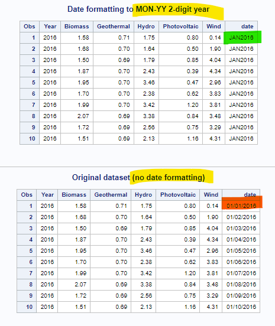

Now, if we wanted to change the format of the *year* variable, we could use the following code. Paste it in your SAS program. 

```
/* Formatting the year variable */

data terna16_year; 
set work.terna16_formatted1; 
format year yyyy4.; 
run; 
proc print data=work.terna16_year (obs = 10);
run; 
```

With this code we are: 
* taking the variables from *terna16_formatted1* dataset, which, remember, contains the *date* variable formatted as mon-yyyy; 
* using **yyyy4.** to specify that the *year* variable is a date variable, specifically the year value which must be maximum *4 characters long*; 
* printing the first 10 observations of the new dataset *terna16_year*.

The result should look like this. 


From the output you don't see any difference, which is normal because we haven't told SAS to change the length of the variable, **we have only specified that it is a year (date-time) type of value**. You can actually see the difference when running the PROC CONTENTS on the data set. 

```
proc contents data=work.terna16_year; 
run; 
```

This is the output. 


In that same table you can actually see all the formatting modifications we have applied to the dataset: 
* The numeric variables present the maxmimum character length of 5 and the 2 decimal places; 
* The *date* variable has the informat equal to *DDMMYY10.* and the format (displayed) as *MON-YY7.*; 
* The *year* variable has the format as *YYYY4.*. 

We can compare the two tables from the contents procedure **before** and **after** formatting, to see the difference. 

/* comparison before and after formatting - proc contents */

proc contents data=work.terna16 (obs=10); 
proc contents data=work.terna16_year (obs=10);
run; 

Check out the results below. 


### String (in)formatting 

This table shows a few common examples of (in)formatting types used for string type values.

| Syntax | Definition | Width range | Default width |
|:---:|:---:|:---:|:---:|
| $*w.* | Reads character data and *trims leading blanks* | 1–32,767 | None |
| $CHAR*w.* | Reads character data but *does not trim* leading or trailing blanks | 1–32,767 | 8 or length of var | 
| $UPCASE*w.* | Converts character data to *upcase* | 1–32,767 | 8 | 
| $QUOTE*w.* | Removes *matching quotation marks* from character data | 2 if var length undefined, otherwise length of var + 2 | 2–32767 |
| $REVERS*w.* | Reads character data *from right to left and left aligns*, removes *blanks* | 1 if width of output field not specified | 1–32767 | 
| $VARYING*w.* | Reads character data of *varying length* | Default length of variable; 8 if variable is undefined | 1–32767 | 

Let's see an example with our dataset, to work with string formatting.

As it is, the dataset doesn't present any string-like variables. We can create a new variable so that we can practice with this type of format. 

```
/* Creating a new variable containing the name of the dataset */ 

data terna16_newvar; 
set work.terna16_year;
dataset_name = "terna 2016";
run;

proc print data=work.terna16_newvar (obs=10);
run;
```

Let's understand the code: 
* Remember that **set** *copies* the information or part of it from an already existing dataset to a new one. 
* When copying a dataset with the set statement, you also have the possibility to *add new variables* - whether they are calculated fields, string values, date values, etc. In our case we are creating a new variable called *dataset_name*, which is going to print a constant string value: *Terna 2016*.

You can see the dataset now presents this addition by printing it (proc print) and having a look at the results tab. 

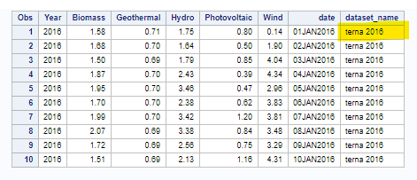

Okay, now we can start formatting the data. First we can set the informats and formats to be of a specified character data type.

```
/* proc contents data=work.terna16_newvar;
run; */

data terna16_newvar_formatted; 
set work.terna16_newvar;
informat dataset_name $CHAR10.;
format dataset_name $CHAR10.; 
run; 
```

We haven't changed the length of the variable while setting formats and informats and that is why we don't see any difference in the resulting dataset.

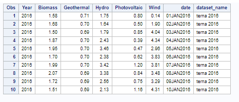

In this case we can only see the difference when running a PROC CONTENTS. 


You can see the difference between proc contents a) and b).
* A) The PROC CONTENTS shows the dataset before formatting and we can see that SAS recognises the variable *dataset_name* is character variable of length 10; 
* B) The PROC CONTENTS shows the dataset after formatting and we can see the formatting and informatting specified as $CHAR10. variable.

Let's see what happens if we tried to change the character length of the variable.

```
/* Formatting with smaller character length */

data terna16_newvar_formatted5; 
set work.terna16_newvar;
informat dataset_name $CHAR5.;
format dataset_name $CHAR5.; 
run; 
```

We have reduced the maximum character length allowed for the variable from 10 to 5. In this way, the string we have input earlier is cut only showing the word *"Terna"* out of the entire string.

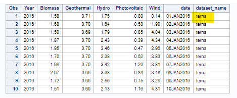

If we set the character length to be *7*, for example, we would start to see part of the next "word" (in our case the year 2016). 

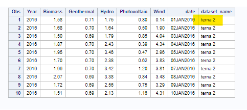

For this reason, remember to format **a reasonable character length** according to the type of string value you want to display.

Let's do another formatting example. Say we want to set all values for the string variable to be upcase. This is very simple to do with the *$UPCASE.* formatting specification. 

Paste this code in your program. 

```
/* Format string data type to be UPCASE*/

data terna16_newvar_upcase; 
set work.terna16_newvar;
informat dataset_name $UPCASE10.;
format dataset_name $UPCASE10.; 
run; 

proc print data=work.terna16_newvar_upcase (obs=10);
run;
```

The characters of the string have effectively been converted to upcase. 


And we can verify the change in format with the PROC CONTENTS. 

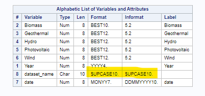

<a name="subsect4"></a>

## PROC FORMAT

There is another method to define formats and informats, and that is with the **PROC FORMAT**. PROC FORMAT is a procedure creating a mapping of data values into **data labels**, thus formats and informats that can later be **explicitly assigned** to a dataset. 

Therefore, with the PROC FORMAT we can create customised formats and informats that we can store in a library to use whenever it is needed. A very useful tool with a vast range of applications of which we are going to explore a few. 

Generally, this is the syntax of a PROC FORMAT for creating a *format*:  

```
PROC FORMAT; 
VALUE Format_Name 
                  Range1 = 'Label1'
                  Range2 = 'Label2'
                  Range3 = 'Label3'
                  ...
                  ...;
RUN; 
```

While this is the syntax for creating an *informat*: 

```
PROC FORMAT; 
INVALUE Format_Name  
                  Range1 = 'Label1'
                  Range2 = 'Label2'
                  Range3 = 'Label3'
                  ...
                  ...; 
RUN; 
```

The main difference between the two is that to define a format a **VALUE** statement needs to be specified, while to define an informat an **INVALUE** statement is appropriate.

Let's break down the syntax: 
* *PROC FORMAT* calls the procedure step;
* *VALUE* or *INVALUE* determines whether it is a format or informat that is being defined; 
* *Format_Name* is the name of the format or informat that is being defined:
  * For character values, first character must be a *$* sign, and a *letter* or *underscore* as the second character;
  * For numeric values, the name must have a *letter* or *underscore* as the first character;
  * The name *cannot end with a number*;
  * It *cannot have the same name as an exisitng SAS format*;
  * It *should not end with a period in the VALUE statement*;
* *Range1,Range2,...* is the value(s) to which a label is assigned. This can be a **single value, ranges of values or lists of values** for a single label;
* *'Labeln'* is the label that reflects a specific value or range of values:
  * Labels do not require enclosing in single or double quotes;
  * Can be up to 32,767 characters in length;
* *RUN* ends and runs the above procedure, although it is not fundamental but *always good practice* to write it at the end of a step.

Let's put this into practice. We can first create a format to group the amount of energy produced by each renewable energy source. 

Paste the following code in your SAS program. We are defining a proc format that subdivides various *ranges of energy generated*.

```
/* Creating format for grouping amount of energy generated */ 

proc format;
value generation 
  0.0 -< 0.5 = "Up to 0.5 GWh"
  0.5 -< 1.0 = "Between 0.5 and 1.0 GWh"
  1.0 -< 2.0 = "Between 1.0 and 2.0 GWh"
  2.0 -< 4.0 = "Between 2.0 and 4.0 GWh"
  4.0 -< 6.0 = "Between 4.0 and 6.0 GWh"
  6.0 - high = "Greater than 6.0 GWh";
run; 
```

Note that to specify the maximum value of the range you need to write *high* on the right-hand side of the range, while if you wanted to write the minimum value of the range you would need to write *low* at the left-hand side of the range.

To apply the format we need to use the format statement, specify the variables to format and write next to them the name of the new format with the *period sign* at the end of it. Like so:

```
data terna16_proc_formatted;
set work.terna16_newvar_upcase;
format  Biomass Geothermal Hydro Photovoltaic Wind generation.; 
run; 

proc print data=work.terna16_proc_formatted;
run;
```

Once you've run this code, you can see that the variables describing energy generated for each renewable source have changed according to the labels specified in the proc format. 


Make sure you have written *value* as the statement to define a *format*. You can check that it won't work as an *informat* like this: 

```
data terna16_proc_formatted;
set work.terna16_newvar_upcase;
INFORMAT  Biomass Geothermal Hydro Photovoltaic Wind generation.; 
run; 

proc print data=work.terna16_proc_formatted;
run;
```

If you now run the code you will see that nothing has changed in the output - the informat *generation.* has not worked because it does not exist.

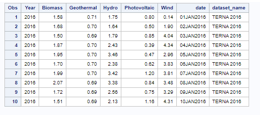

For our last example, we are going to categorise our date variable into the four seasons, following the days of solstice and equinox as our ranges for the four labels. Paste the following code into your SAS program: 

```
/* Date values into seasons */ 

proc format; 
value seasons
	'01JAN2016'd-'21MAR2016'd = "Winter"
	'22MAR2016'd-'21JUN2016'd = "Spring"
	'22JUN2016'd-'21SEP2016'd = "Summer" 
	'22SEP2016'd-'21NOV2016'd = "Autumn"
	'22NOV2016'd-'31DEC2016'd = "Winter";
		
data terna16_seasons; 
set work.terna16_proc_formatted; 
format seasons seasons.; 
seasons = date;
run;

proc print data=work.terna16_seasons;
run;
```

We have created a new variable called *seasons* to carry out the formatting on the dataset. This way we don't have to overwrite the date variable and we can look at them side by side.

This is the resulting dataset (I am only showing snippets of it, to demonstrate the four groups corresponding to the seasons):


#### Formats and informats are stored in a SAS catalog

We can find all the formats and informats we've just creaated are now stored in a SAS catalog. 

Use the code we used in the [proc contents](#proc-contents) above, where we printed the directory and filtered the memtype to catalogs only.

This is the output:

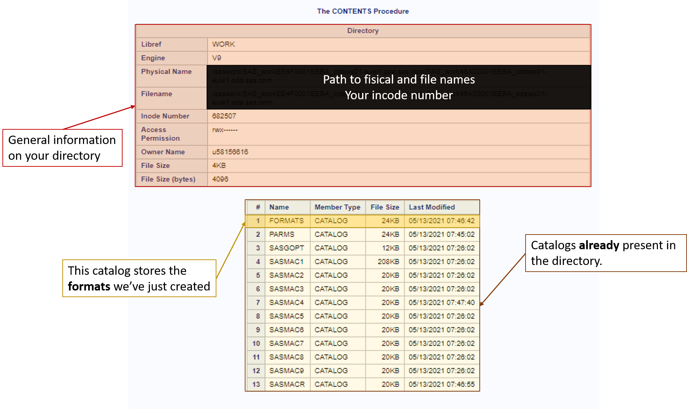

<a name="sect3"></a>

# 3. Features and manipulations

We have formatted our data and displayed them as we liked. 
Now, we can explore some data manipulation techniques further using **DATA step functions**.

##### Functions run in CAS

Some functions explained here can also be run in CAS, while others run in SAS *only*. If you are interested or need to write functions that run on the CAS server, check out [this link](https://documentation.sas.com/doc/de/pgmsascdc/9.4_3.5/lefunctionsref/n01f5qrjoh9h4hn1olbdpb5pr2td.htm) listing **functions and call routines by category**. Head down to the CAS category to see which functions which are accepted in CAS. 

If you want to initiate a CAS session, follow the section 6 on *"How to open a CAS session"* from the **data access** tutorial at [this link](https://sastutorials.github.io/tutorials/accessing_data.html#sect6).

See examples of executing functions that output to CAS or on CAS at [this link](https://documentation.sas.com/doc/de/pgmsascdc/9.4_3.5/lefunctionsref/n1ajdn61edqo70n1jfu3h5bcu0f5.htm).

<a name = "subsect5"></a>

## Feature engineering 

Let's take the latest dataset with the seasons and make some changes on it. Paste the following code in your SAS program: 

```
/* Adding new features to our dataset*/

data terna16_cleaning (drop= year); 
set work.terna16_seasons;
informat date_upd datetime22.;
format dataset_name $LOWCASE10. date_upd datetime22. ;
short_name = propcase(compress(dataset_name, " 20"));
sum_energy_day = round(sum(Wind, Geothermal, Hydro, Photovoltaic, Biomass));
mean_energy_day_low = floor(mean(Wind, Geothermal, Hydro, Photovoltaic, Biomass));
mean_energy_day_high = ceil(mean(Wind, Geothermal, Hydro, Photovoltaic, Biomass));
dif_Wind = dif(Wind);
dif_Geothermal = dif(Geothermal);
dif_Hydro = dif(Hydro);
dif_Photovoltaic = dif(Photovoltaic);
dif_Biomass = dif(Biomass);
day_month = substr(put(date, DATE9.), 1, 5) || " dd-mmm";
date_upd = datetime();
run; 

proc print data=work.terna16_cleaning (obs=10);
run;
```

There is a lot going on here. We have done some **feature engineering**, which means creating new variables as a result of calculations or conditions from the existing variables. By creating new features, we are also exploring a variety of **DATA step functions** for character, numeric and date variables. This is the output (the first 10 rows of the dataset):

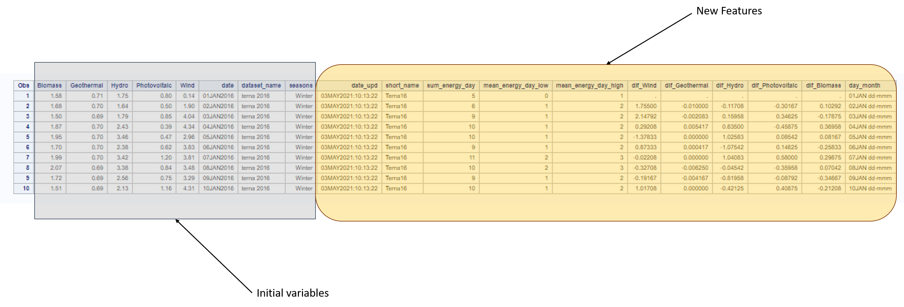

Don't panic! **Let's go through the code line by line.**

### data terna16_cleaning (drop = year); 
### set work.terna16_seasons;

Aside from creating a new dataset, we are telling SAS not to copy one variable from the other dataset (*work.terna16_seasons*), and that variable is *year*. 

This is what the output looks like having dropped the variable: 

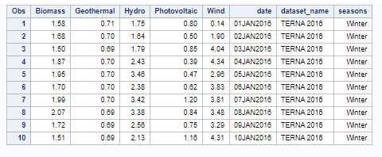

### informat date_upd datetime22.;
### format dataset_name $LOWCASE10. date_upd datetime22. ;

First thing we need to do before the new features is to set any new formats or informats so that SAS can read and display them correctly. In this case, we need to create and informat and format for the new feature *date_upd*; we are also setting the existing variable *dataset_name* to **lower case**, so that we could do some data manipulation on the variable which we couldn't formatted as **upper case** as we left it. 

### short_name = propcase(compress(dataset_name, " 20"));

Here we are creating a new variable called *short_name*, where we are using two new character functions: **compress** and **propcase**. 

* **compress** removes any delimiter or character string specified, from a character variable. With compress we are removing the *blank between the name "terna" and the date, and we are also removing the **20** from the year part of the character string*;
* **propcase** returns the new character variable with the first letter converted to *uppercase*.

This is what the result looks like (together with the format statement): 

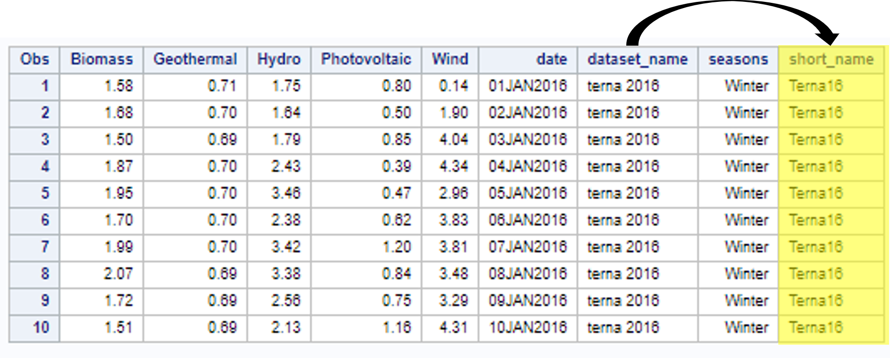

### sum_energy_day = round(sum(Wind, Geothermal, Hydro, Photovoltaic, Biomass));

This new variable, *sum_energy_day* is calculating the total energy generated (GWh) by the 5 renewable energy resources each day. The **sum()** function calculates by row and over different columns that need to be specified - in our case, the renewables. 

Not only we are summing row by row, but we have also wrapped the sum around another numeric function **round()**, which rounds up the value to the nearest integer value (could be *either lower or higher*). Our result is the total energy generated but rounded up to be an integer, like so: 

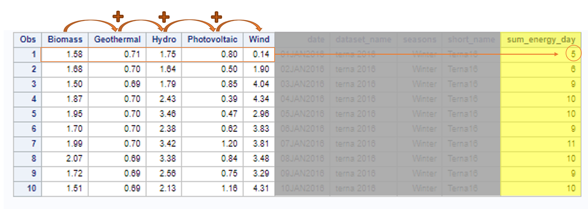

### mean_energy_day_low = floor(mean(Wind, Geothermal, Hydro, Photovoltaic, Biomass));

For the new variable *mean_energy_day_low* we are instead calculating the daily average of energy generated (GWh) across the 5 renewables. The **mean()** functions works just like sum(): it calculates across variables, by row. 

This time, we are rounding the resulting values to the lowest decimal, thanks to the **floor()** numeric function. 

The output with this new feature now looks like this:

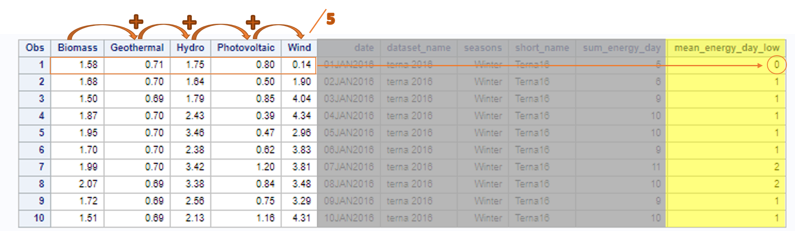

### mean_energy_day_high = ceil(mean(Wind, Geothermal, Hydro, Photovoltaic, Biomass));

For the variable *mean_energy_day_high* we are doing exactly the same thing as above, calculating the mean energy generated by day. The difference lies in the **integer rounding function**: in fact, **ceil()** does the opposite of *floor()*, because it **rounds up the value to the highest integer**, instead of the lowest. 

Just like so: 

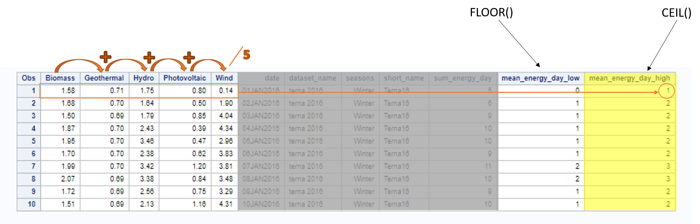

### dif_Wind = dif(Wind);
### dif_Geothermal = dif(Geothermal);
### dif_Hydro = dif(Hydro);
### dif_Photovoltaic = dif(Photovoltaic);
### dif_Biomass = dif(Biomass);

These 5 new variables are called *dif_Wind*, *dif_Geothermal*, *dif_Hydro*, *dif_Photovoltaic* and *dif_Biomass*, and reflect the **difference in energy generated from one day to the next** for each renewable energy source. This calculation is possible and quick thanks to the numeric function **dif()**.

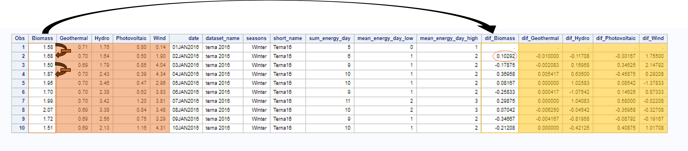

### day_month = substr(put(date, DATE9.), 1, 5) || " dd-mmm";

In the new variable *day_month* we have nested two functions:
* **put()**, a charater function which converts numeric values to character values. In this case, **we are modifying the date value to character value, still specifying a date format for the conversion, for SAS to be able to read the data properly**;
* **substr()**, another character function which extracts a segment or segments from a character string, specified by the character position. We are extracting a string starting from the first character and for the length of 5 characters. We are thus selecting the day and month parts of the date. 

Not only, with **substr()** it is also possible to concatenate other string character values, through the **`||`** symbol, followed by the new string. 

The new variable looks like this: 

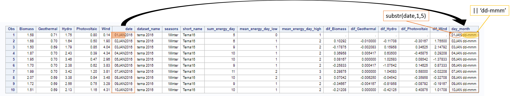

### date_upd = datetime();

The last variable we created is *date_upd*. This simply takes the current date and time values, thanks to the date function **datetime()**. This could be useful if you want to keep track of the date and time of your latest updates, as, whenever you run the code, this variable is going to be updated with the date and time when you did the execution. Remember to create this variable we had to specify informats and formats for SAS to read and display it correctly.

Now that we've progressively added each new line of code, we can have a look at the final dataset, with the last addition *date_upd*.

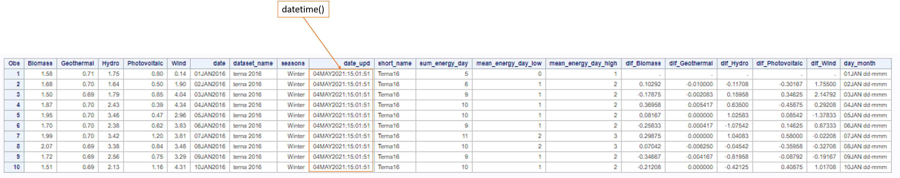

<a name="subsect6"></a>

## Combine datasets

As our last manipulation we are going to combine two datasets - the one we've been working on so far and another one on renewable energy generation in 2017.

There are a variety of methods to combine datasets, but we're going to look at two:
* Concatenation;
* Match-merging.

Before starting paste the following code which formats and creates new variables for the second dataset too. This is what we've been doing throughout the tutorial, so don't focus too much on the code and let's move on to the methods of combining datasets.

```
/* working with terna '17 */
data terna17_formatted; 
set work.terna17;
informat date mmddyyyy10. dataset_name $CHAR10. date_upd datetime22.;
format Biomass 3.1 Wind 3.2 Geothermal 3.1 Hydro 3.1 Photovoltaic 3.1 date date9. year yyyy4.
dataset_name $CHAR10. seasons seasons. dataset_name $LOWCASE10. date_upd datetime22.;
dataset_name = "terna 2017";
seasons = date;
short_name = propcase(compress(dataset_name, " 20"));
sum_energy_day = round(sum(Wind, Geothermal, Hydro, Photovoltaic, Biomass));
mean_energy_day_low = floor(mean(Wind, Geothermal, Hydro, Photovoltaic, Biomass));
mean_energy_day_high = ceil(mean(Wind, Geothermal, Hydro, Photovoltaic, Biomass));
day_month = substr(put(date, DATE9.), 1, 5) || " dd-mmm";
date_upd = datetime();
run;
```

### Concatenation

We can concatenate two or more datasets using the **set statement**.

Paste the following code on your SAS program.

```
data terna16_17; 
set work.terna16_cleaning1 work.terna17_formatted;
run;

proc print data=work.terna16_17;
run;
```

### Match-merging

Another method to concatenate multiple datasets into one is to use the **merge** statement in a DATA step. 

```
data terna_matched;
merge  work.terna16_cleaning1 work.terna17_formatted;
by date;
run; 

proc print data=work.terna_matched;
run;
```

Whether you decide to use **concatenation** or **match-merging**, the resulting dataset is the same. 

If you look at the output, you are going to see that where column names match the two datasets are merged one on top of the other. Instead, where columns are missing in either dataset SAS automatically fills them as *missing* values.

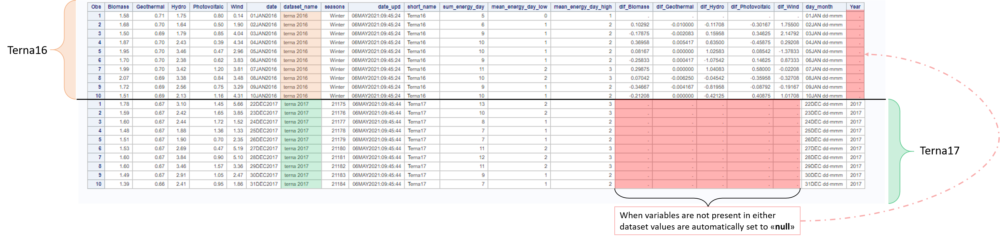

<a name="sect4"></a>

# 4. Save your new dataset!

You can save your new, manipulated dataset with a **PROC EXPORT**.

To do so, paste the following code: 

```
proc export outfile="HOME_FILE_PATH/terna16_17.xls"
dbms= xls data=work.terna_matched;
run;
```

This is what the code is doing

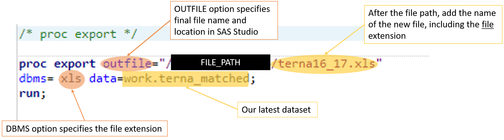

You should now see the new dataset on the left-hand side of the interface, which you can then download and save in your local machine.

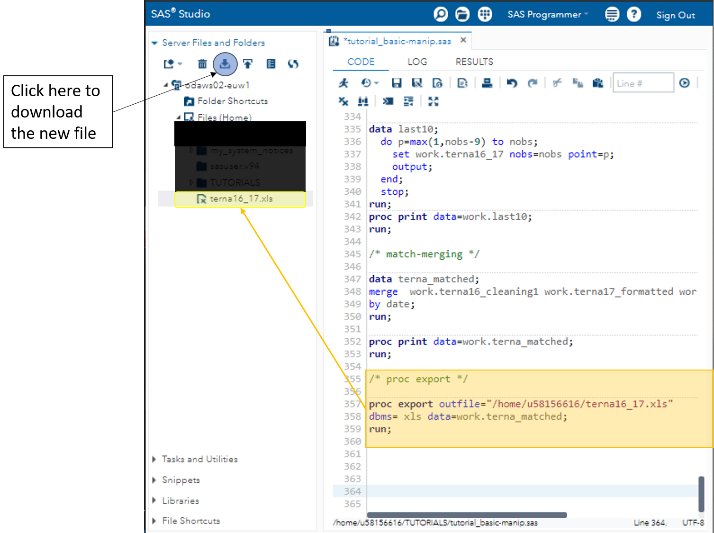

<a  name="sect5"></a>

# 5. Exercises and extras

**Try data manipulation on your own!**

You have other 4 datasets at your disposal that you can play with. Clean them, modify them, create new variables, and in the end, merge them all together!

<a name="sect6"></a>

# 6. Resources

* [PROC CONTENTS](https://documentation.sas.com/doc/en/pgmsascdc/9.4_3.5/proc/n1hqa4dk5tay0an15nrys1iwr5o2.htm);
* [PROC PRINT](https://documentation.sas.com/doc/en/pgmsascdc/9.4_3.5/proc/p10qiuo2yicr4qn17rav8kptnjpu.htm);
* [Informats and formats by category](http://v8doc.sas.com/sashtml/lrcon/z0920449.htm);
* [Functions and CALL routines by category](https://documentation.sas.com/doc/de/pgmsascdc/9.4_3.5/lefunctionsref/n01f5qrjoh9h4hn1olbdpb5pr2td.htm);
* [Functions in SAS and CAS - examples](https://documentation.sas.com/doc/de/pgmsascdc/9.4_3.5/lefunctionsref/n1ajdn61edqo70n1jfu3h5bcu0f5.htm).