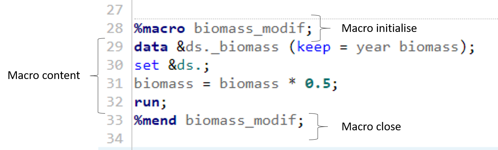
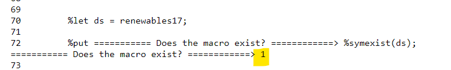

--- 
layout: default
author: Anna
title: Write flexible code with SAS Macros
subtitle: Learn about the Macro language, and how to integrate them in your program to write flexible and modular code.
--- 


# Learning Objectives 

* Learn about the macro language, its syntax and unique features;
* Learn about the difference between macros and macro variables;
* Learn how to use macros to optimise code writing and create modular code that can be recalled at need;
* Become familiar with the macro language to start programming with more flexibility throughout different SAS programs and ETLs.

# Structure

<a href="#sect1">1. What is the Macro language in SAS?</a>

<a href="#subsect1"><sub>Structure and syntax</sub></a>

<a href="#sect2">2. Built-in macro variables</a>

<a href="#subsect4"><sub>%Let and %put macros</sub></a>

<a href="#subsect5"><sub>Conditional logic</sub></a>

<a href="#sect3">3. Custom macro variables</a>

<a href="#subsect6"><sub>The %macro - %mend couple</sub></a>

<a href="#subsect7"><sub>Adding parameters to the macro</sub></a>

<a href="#"><sub>Iterations</sub></a>

<a href="#subsect3"><sub>Think %global act local</sub></a>

<a href="#sect4">4. Data-driven programs</a>

<a href="#subsect8"><sub>DATA step interfaces</sub></a>

* symget
* symput
* check out interm sas macro pdf 

<a href="#subsect9"><sub>DATA step functions in macros</sub></a>

<a href="#subsec10"><sub>PROC SQL interfaces</sub></a>

* into

<a href="#sect5">5. Exercise: create an ETL-type program</a>

<a href="#subsect11"><sub>Definition of ETL</sub></a>

<a href="#subsect12"><sub>Download the SAS programs to do the exercise</sub></a>

<a href="#sect6">6. References</a>


<a name="sect1"></a>

# 1. What is the Macro language in SAS?

The macro language is an entirely "new world" within SAS, a tool that allows your code to be **dynamic and flexible**.

Syntax and structure of macros can be a bit hard to get a grasp on at first, but they possess great advantages, which include:

* Reduction of regular code;
* Programming optimisation;
* Automatic generation of SAS code;
* Facilitation of information passed from one procedure to the other and from one program to another;
* Reduced read/write effort of SAS code;
* Generation of data-driven programs, letting SAS decide what to do based on actual data values.

These advantages can be really understood when using programs that need to be run frequently, perhaps on a daily basis. Otherwise, **macro code takes longer to write and debug** and might become a disadvantage if you decided to use it for simple programs or programs that would only be run a few times.

<a name="subsect1"></a>

## Structure and syntax

The first thing to remember is that, differently from regular SAS code, macros pass through a **Macro processor**, which then generates SAS code. 

Here is a schematic view of the workflow. 


Essentially, you are writing a program that writes a program, and this is also called **meta-programming**.

The syntax is simple and defines different types of macros:
* Macros are called or created by placing a **percent sign** (%) at the start of the word;
* Macro variables are called instead by placing an **ampersand** (&) at the start of the word and a **period** (.) sign at the end of the word. **Note** **that the period sign** is not fundamental but **it's good practice to use**.

Macros and macro variables can be nested within a macro program. The macro program can also contain more complex logic including complete DATA and PROC steps other than other macros.

**!!!!!!!Inserire un'immagine schematica della spiegazione di sopra!!!!!!!!!!!**

<a name="sect2"></a>

# 2. Built-in macro variables 

<a name="subsect4"></a>

## The %let and %put macros 

Let's see an example of creating a macro to a dataset name, still using dataset terna16 from the previous tutorials. 

```
%let ds = terna16;

proc print data = &ds.;
run;
```

This code is very simple: as we've previously seen it prints out the dataset called terna16 in its entirety. 

The difference is that we have placed the **dataset name** inside a macro, and we have called this macro **"ds"**. Whenever we need to call the dataset name we **no longer need to write "terna16", but &ds. is enough**.

We can have a look at what the macro contains by printing the content of the macro itself, by using another built-in macro called **%put**. %PUT will print anything written next to it in the **log**, and strings don't require quotes. Let's see this example:

```
/* printing the macro in the log with %put */

%put   print ==============>  &ds <=============;
```

Now check the log. 


If we ever wanted to change dataset or dataset name, **we would need to change it in the macro, and not everywhere we use the dataset in the code**, like so:

```
%let ds = terna17;

proc print data=&ds.;
run;
```

This code here instead of printing terna16 now prints terna17. 

You can imagine how this process becomes extremely useful when **the same lines of code or when variable names are repeated throughout long programs of code**.


<a name="subsect5"></a>

## Conditional logic

Another type of built-in macros relates to structuring code that requires execution of a **conditional logic**.

We are going to execute a simple condition: if the file exists then we can print it otherwise we are going to print an error message in the log. 

The code is the following: 

```
/* macros: conditional logic */

%if %sysfunc(exist(&ds.)) %then %do; 
    proc print data=&ds.;
    run;
%end; 
%else %do; 
    %put ========> WARNING: the file &ds does not exist. The operation has been skipped. ;
%end; 
```

As you run it you can see that the output does appear as **the first condtion applies**. 

If we changed the name of the dataset to print that **does not exist in work library**, like so: 

```
/* macros: conditional logic */

%let ds1 = terna18; 

%if %sysfunc(exist(&ds1.)) %then %do; 
    proc print data=&ds1.;
    run;
%end; 
%else %do; 
    %put ========> WARNING: the file &ds1. does not exist. The operation has been skipped. ;
%end; 
```

We can now see that there is no output, but if you check the log **the message from the second condition appears**: 


**Note:** we've added another built-in macro, **%sysfunc**, which is useful as it allows to **execute SAS functions or user-written functions inside a macro-like logic**. In this case we've used the function *exist()* to confirm the presence of the dataset in *work*.

<a name="sect3"></a>

# 3. Custom macro variables

So far we've seen a few examples of macro variables **which already exist in SAS**. The flexibility of macro language relies in the fact that **we are able to create custom macros to optimise and facilitate our programming**.

<a name="subsect6"></a>

## The %macro - %mend couple

To create a custom macro variable we first need to specify *%macro*, which initialises the creation of a *new macro*, followed by the *name we want to give the macro*. Say we want to create a macro called *biomass_modif* - the first thing we need to write is:

```
%macro biomass_modif;
```

Then we need to write whatever code (written in SAS or combined with more macros) that we want the macro to execute:

```
data &ds._biomass (keep = year biomass1);
set &ds.; 
biomass1 = biomass * 0.5; 
run; 
```

To *close* the macro we need to specify another built-in macro called **%mend**. It is good practice to specify the name of the new macro next to *%mend* too, although not strictly necessary. Like so:

```
%mend biomass_modif;
```

This is what the macro should look like overall:



If you run the code, nothing is output as the macro has been created *not executed*. To recall the macro and execute it you just need to use it like we've used previous built-in macros: 

```
%biomass_modif;
```

As you run the line of code above, the macro does execute and creates a new dataset called *terna17_biomass*, which you can see in the *output data* tab.


Any time we want to create a new dataset called *terna17_biomass*, it is sufficient to run our new macro *%biomass_modif*.

<a name="subsect7"></a>

## Adding parameters to the macro variable 

**Don't you think the code we wrote above is yet not so efficient?**

Whenever we execute *%biomass_modif* we will only be able to modify a **specific column** called *biomass* inside of a **speicific dataset** called *terna17*. 

What if we wanted to **modify different datasets** and **different columns**, and what if we wanted to **use a different parameter**, in this case to multiply the variable with? 

We can do so specifying **parameters** that need to be input in the macro.

```
%macro variable_modif (lib=, data= , var= , newvar= , num=0.5);  
data &data._&var. (keep = year &newvar.);
set &data.; 
&newvar. = &var. * &num.; 
run; 
%mend variable_modif; 
```

As you can see, **the parameters are set within brackets** on the line that initialises the macro. If you don't want to leave your parameter open, but want to associate a **default value** to it, you can just specify it within the brackets. We did so, setting *0.5* to be the default value for our *num* parameter. 

Once we call the macro, then we can specify the remaining variables that we want the macro to use. We don't need to specify the *num* parameter, unless we want to *change* the default value.

```
%variable_modif(lib = work, data = terna17, var = biomass, newvar = biomass1);
```

In this case, I've added the same parameters as the macro above *without* *parameters*. in fact the output is the same. 


However, it is *now* that we can see the true flexibility of macros: we can change any of the parameters to our need, and modify any variables or dataset we want.

```
%variable_modif(lib=work, data=terna17, var=Wind,newvar=  wind_modif);
```

This time we have set the *var* to be "Wind" and the *newvar* to be called *wind_modif*, creating a new dataset called *terna17_wind*.


We could even change the default value of *num* if we wanted to multiply the variable, for example by *2.0*.

```
%variable_modif(lib=work, data=terna17, var=Wind,newvar=  wind_modif, num=2.0);
```

And this is the resulting output: 


## Iterations 

It is also possible to carry out iterations but **only within a macro specification**. Unlike using conditional logic with %if-%then %do parameters both in open code and within a macro, built-in macros like %do and %do %until **cannot be used in open code**.

Let's see an example, where we apply a multiplication on the variable biomass from terna17 and we loop this calculation 10 times, each time incrementing the value of the multiplier. 

```
%macro count_hundred;   
%do I=1 %TO 10;  
%put *** LOOP &I OF 10;  
data loop_count&I.;
set &ds.;
biomass_looped = biomass * &I.;
Title "Printing dataset loop_count&I.";
proc print data = loop_count&I. (obs = 10);
%end;
%mend;
%count_hundred;
```

Interestingly, inside the macro %do loop, the *i* parameter automatically **becomes a macro**, which can be easily applied inside the rest of the macro. In this case, we have used it to create different datasets holding the different values of i, and we have also used i as multiplier for the variable *biomass*. Note that we are still using the macro &ds., which contains the name of the dataset terna17.

This is what we see in the results tab: 


And this is what we see printed in the log;


<a name="subsect3"></a>

## Think %global act %local 

Macro variables can be created by assigning a specific scope to them. **Scope** is meant as **the duration of existence of the macro variable in a session or job, and the application of the variable in the code**.

The scope is assigned with two built-in macros: **%global** and **%local**.

* **%global** is a statement that creates one or more macro variables that are **available during the entire execution of a SAS session or job and can be referenced anywhere in the program**; 
* **%local** is a statement that exists only during the execution of the macro in which **the variable(s) is/are created and have no meaning outside of the defining macro**. 

**Macro variables take default scopes depending on where they are being defined.**

* If a macro variable is defined with the **%let** statement, then it will take the *%global* scope as default. 

We've previously seen this happen when we defined the dataset *terna17* as the macro called *ds*.

```
%let ds = terna17;
```

If we call the macro variable in any other program and part of the same program, the macro variable would still exist and would execute. 


* If a macro *is only defined within another macro*, then it only exists when the outer macro is executed.

Let's use the macro *%biomass_modif* we created earlier. Recall the code from below, but with one change. We are going to define a new macro variable inside the macro, to call the variable name *biomass*. Like so: 

```
%macro biomass_modif;  
%let namevar = biomass;
data &ds._biomass (keep = year &namevar);
set &ds.; 
&namevar = &namevar * 0.5; 
run; 
%mend biomass_modif; 

%biomass_modif;
```

The dataset is created successfully.


However, if we wanted to use the macro *namevar* outside of the macro *biomass_modif*, we would not succeed.

```
Title "Printing &namevar.";
proc print data=terna17_biomass (keep= &namevar. obs=10);
run; 
```

That is because the macro *namevar* has the scope set to *local* as default, by being created inside of the macro *biomass_modif*.

We get the following errors in the log: 


To solve this issue, we can either insert the print procedure inside the *%biomass_modif*, or we can set the scope of the *%namevar* macro to **%global**.

* Placing the print procedure inside the macro:

```
%macro biomass_modif;  
%let namevar = biomass;
data &ds._biomass (keep = year &namevar);
set &ds.; 
&namevar = &namevar * 0.5; 
run; 

Title "Printing &namevar.";
proc print data=terna17_biomass (keep= &namevar. obs=10);
run; 


%mend biomass_modif; 

%biomass_modif;
```

This produces the desired output.


* Specifying the macro variable inside the %global statement:

```
%macro biomass_modif;  
%global namevar;
%let namevar = biomass;
data &ds._biomass (keep = year &namevar);
set &ds.; 
&namevar = &namevar * 0.5; 
run; 
%mend biomass_modif; 

%biomass_modif;


Title "Printing &namevar. with the global statement";
proc print data=terna17_biomass (keep= &namevar. obs=10);
run; 
```

In this way we obtain what we wanted, too, but with the flexibility of writing the print procedure anywhere we want, without having to execute the entire macro *biomass_modif*.


<a name="sect4"></a>

# 4. Data-driven programs

This sections deals with more advanced programming with the macro language, and explains how macro variables and macros can be referenced from outwith the macro facility. 

The following examples will elucidate on how to create code that matches the data available and the processing required, rather than defining the sequence of coding steps to take. This is more commonly called **data-driven programming**.

<a name="subsect8"></a>

## Data step interfaces

**Data step interfaces** are so called because they represent the tools that allow interaction between a DATA step and macro variables.

These interfaces are used to:
* pass on information to following DATA steps via macro variables
* generate and submit SAS statements
* invoke new or exisiting macros during the execution of a DATA step 
* delete a macro variable 
* pass on information about macro variables to a DATA step

The following table shows the list of the most common DATA step interfaces. 

| Interface | Type |Description | Syntax |
|:---:|:---:|:---:|:---:|
| **CALL SYMDEL** | Routine | Deletes a macro variable | *CALL SYMDEL(macro-var <,option>)* | 
| **SYMEXIST** | Function | Verifies existence of a macro variable | *SYMEXIST(macro-var)* | 
| **SYMGET** | Function | Returns a macro variable at execution | *SYMGET(argument)* |
| **SYMGLOBL** | Function | Verifies if macro variable has global scope | *SYMGLOBL(macro-var)* |
| **SYMLOCAL** | Function | Verifies if macro variable has local scope | *SYMLOCAL(macro-var)* |
| **CALL SYMPUT** | Routine | Assigns DATA step values to macro variables | *CALL SYMPUT(macro-var, value)* | 
| **CALL EXECUTE** | Routine | Executes macros immediately and the generated code within it at the next step boundary | *CALL EXECUTE(argument)* |
| **RESOLVE** | Function | Resolves *text expression* at execution | *RESOLVE(argument)* |

Let's see examples of a few of these DATA step interfaces.

### CALL SYMDEL 

This function can be useful to delete any unnecessary macros - it allows you to keep your dictionary tables (that we saw with the PROC CONTENTS previously) clean and frees memory, which is always important. 

Let's say we want to delete some of the macros we've created so far: macro *ds*, which defined the dataset name "renewables17".

This function can be used as stand-alone macro variable or as function inside a data step.

Using the function as macro variable will look like the following piece of code. I added a %put before and after the macro to see the difference in the log.

```
%put  ========> &ds.; 

%symdel ds;

%put  ========>  &ds;
```

This is what we can see in the log:


On the other hand, using the function within a DATA step looks like this:

```
%put  ========>  &ds;

data _null_;
	call symdel('ds');
run;

%put  ========>  &ds;
```

And this is what we would see in the log: 


As you can see we obtain the same result in both instances. 

### SYMEXIST 

Symexist is an ideal macro variable that allows you to check whether a user defined macro variable exists or not. It is usually used within an if/then logic as this macro returns a *boolean* value (0 = False; 1 = True). 

We can quickly see how it works, following up on the macro *ds* we have just deleted through the function *call symdel*. Let's print a check on the log, which is going to return a boolean value depending on whether the macro variable does exist. 

```
%put =========== Does the macro exist? ============> %symexist(ds);
```

Once we've run this simple piece of code, we can check the result to see what the macro *%symexist* has returned: 


As you can see, the log prints out a **zero**, confirming the absence of the macro variable. 

Now, if we created the variable once more, and printed out the same sentence in the log, like so: 

```
%let ds = renewables17; 

%put =========== Does the macro exist? ============> %symexist(ds);
```

We would see a positive outcome (1 = True) printed in the log: 



You can understand how useful this macro can be in conditional logics. This is the starting point for more complex conditional structures where *%symexist* could be implemented:

```
%if %symexist(ds) = 1 %then %do;
data macro_boolean; 
	macro_name = "ds";
	existence  = "True"; 
run; 
%end; 
%else %do;
data macro_boolean; 
	macro_name = "ds";
	existence = "False";
run; 
%end;
proc print noobs; 
```

This piece of code creates a dataset which contains the same macro variable name, but prints out a different value in the *existence* field, depending on how the conditional logic resolves. 

As we last recreated the macro *ds*, the conditional logic is resolved in the first if/then condition. This is what we can see in the *Results* tab. 


### CALL SYMPUT and SYMGET

The last two data step interfaces we are looking at are also the most frequently used, especially when combined, as one is the *reciprocal* of the other in "bridging communication" between a DATA step and the macro facility. 

Here's a schematic diagram of the relationship between CALL SYMPUT and SYMGET. 


In short:
* **CALL SYMPUT** turns an element created inside a DATA step into a *mcaro variable*;
* **SYMGET** allows the application of a macro variable inside a DATA step.

Let's see a practical example where two variables in a DATA step are first made into macro variables with *call symput*, and then are re-implemented into a second DATA step through *symget*.

```
data renewables17_call_symput; 
set renewables17(keep = hydro wind date);
	if hydro > wind then
		call symput('hydro'||left(_n_), hydro);
	else;
		call symput('wind',wind);
run; 

data hydro_wind (drop = wind hydro); 
set renewables17_call_symput; 
    hydro_KW = symget('hydro'||left(_n_))*1000; 
    wind_KW = &wind. * 1000; 
run; 
proc print;
```

If we break this code down by DATA step: 
1. In the first DATA step we have created a new dataset called *renewables17_call_symput* from our dataset renewables17
	* Inside a condition, we are comparing energy levels produced by hydro and wind power:
    	* If hydro power is greater than wind then the new macro variable called *hydro_n* (where n is the n*th* row) contains the values of hydro power; 
    	* Otherwise, the new macro called *wind* contains the values of wind power. 
2. In the second DATA step we have created a new dataset called *hydro_wind*, duplicated from the previous dataset renewables17_call_symput*
	* We create a new variable called *hydro_KW*, as the result of the content inside the macro *hydro_n* times 1000;
	* We create a second new variable called *wind_KW*, as the result of the macro *wind* times 1000.


<a name="subsect9"></a>

## Data step functions in macros

<a name="subsect10"></a>

## PROC SQL interfaces

<a name="sect5"></a>

# 5. Exercise: create and ETL-type program

<a name="subsect11"></a>

## Definition of ETL 

<a name="subsect12"></a>

## Download the SAS programs to do the exercise

<a name="sect6"></a>

# 6. References