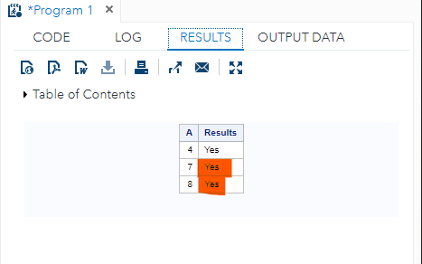
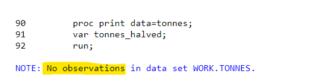

--- 
layout: default
title: Intro to SAS pt. II
subtitle: Troubleshooting and how to find help.
--- 

## Learning Objectives

* Take advantage of SAS Studio's smart programming features

* Learn how to read and interpret the Log window 

* Familiarise yourself with some common programming errors you might run into

## Structure

<a href="#sect1">1. SAS Official Support</a>

<a href="#subsect1"><sub>SAS Studio smart features</sub></a>

<a href="#subsect2"><sub>Log window</sub></a>

<a href="#subsect3"><sub>Official documentation</sub></a>

<a href="#sect2">2. Common mistakes and how to avoid them</a>

<a href="#sect3">3. Other possible mistakes</a>

<a href="#sect4">4. Try it yourself: fix the errors from a SAS program</a>

<a href="#subsect4"><sub>Debugging tips</sub></a>

<a href="#sect5">5. Resources</a>


<a name="sect1"></a>

# 1. SAS Official Support

<a name="subsect1"></a>

## SAS Studio smart features

As we had mentioned in the previous tutorial "[Getting Started with SAS and SAS Studio](/tutorials/intro-to-sas.html)", SAS Studio is equipped with **smart features**, like *code completion, formatting and syntax colouring*. Make sure to *exploit these features*, which should already help you out not to make unnecessary mistakes. 

In particular, the **code completion** feature allows you to visualise information on the command quickly and to browse for examples by **directing you to the official SAS documentation**. 

Let's have a look at how this works in particular. 

Let's say you are looking for a command, but not quite remember its exact name. You only know it starts with *se*... 


The **code completion** feature gives you suggestions on the existing commands within the *SAS dictionary*, starting from the letters that you typed inside the program editor. In this case, it is suggesting two possible commands starting with *se*: **select** and **set** statements and it already tells you that these two belong to the group of **DATA Step Statements**. If you hover over either, a new window appears on the right hand side, further detailing functionalities, syntax structure, and other information on that particular command. 

**Scrolling down** in that same window, you are offered links that direct you to the **official documentation** and to examples of uses of that particular command. 


 The second smart feature in SAS Studio helps you correctly **format** your code. This is extremely important to help yourself with clearly understanding your code when you want to **go back to a program which you haven't opened in a while and want to rememeber quickly what it is useful for**! 

 Let's say we wrote the following:

```
data trial;
input x y;
cards;
10 3.5 
11 3.6 
10 43.45
34 10
10 230.0
11 34
34 45.6
;

proc print data=trial;
var x; run; 
```

This code is *okay* as it is in the sense that, if you run it, it will create the output correctly. However, we are going to format it properly.

Click on the button highlighted in *yellow* in the image below: **you can see the position of certain commands has changed.** I have highlighted the changes in *green*. 


SAS Studio does not provide automatic smart features for this, but another two important *formatting* *tips* that might help you with clean code writing etiquette, are: 

* **write SAS commands in capital letters**, so you can distinguish them from other text; 
* **comment about your code**, so when you go back to it you already have information on the functionality of your program before you even run it. 

Here is an example of a well-formatted and clean program: 

```
/* This is one way of adding comments to your SAS program*/

DATA trial;    *This is another way to write a comment; 
	INPUT x y;
	CARDS;
10 3.5 
11 3.6 
10 43.45
34 10
10 230.0
11 34
34 45.6
;   *Here we have created a small datasets with numeric variables x and y; 

PROC PRINT data=trial;
	VAR x;
RUN; *Here we are printing only the x variable from the dataset created above; 


*********the program ends here*********; 
```

Last but not least, the **syntax colouring** feature helps you distinguish between **types of commands**, **variables** and **values**, **special characters** and **other symbols**. I guess you've already noticed that from pasting the previous code in your SAS Studio program. 

Here I have taken a snippet of the previous program, adding a few more lines of code to show you what each colour corresponds to. The more you are going to write in SAS the more you are going to become familiar with this smart feature. 


<a name="subsect2"></a>

## Log window

Let's explore SAS Studio's **LOG** window, where error messages, warnings and notes are reported for every line of code run in your program. 

The image below summarises each section of the window. 


* The **top panel** describes the summary for the tree types of messages in the log: errors, warnings and notes; 
* The **bottom panel** shows in detail where the messages refer to in the code; 
* When an error occurs, the **red X inside the circle** appears near the program name. When a warning occurs, the **yellow exclamation mark inside the triangle** appears, instead. 

**Notes** are always present, as they indicate general details on the code run, independently on whether there is an error or not. 

Here is an example of a log window showing the notes *from a program that ran correctly*. Usually, **information on the dataset** created, as well as **time and memory needed** to execute the code, is displayed in the notes. 


On the top of the log window, there are features which you might find useful if you want to preserve the content of a specific log, perhaps if you wish to consult it in the future. 


In particular, you'll find options that will allow you to save a specific log result within your home directory inside SAS Studio, but also to save it as html or print it directly. 

<a name="subsect3"></a>

## Official documentation

At this point, you know that SAS offers its own official documentation, where you can find details about each single command existing in SAS. 

We have already mentioned where to look for help from SAS Studio: either by clicking on the **question mark** (?) on the top bar, or by clicking on **product documentation** from the **code completion** feature of the application. 

The documentation that you have access to from SAS Studio either directs you to the [official SAS Studio Guide](https://documentation.sas.com/?activeCdc=webeditocdc&cdcId=sasstudiocdc&cdcVersion=3.7&docsetId=sasstudioov&docsetTarget=aboutthedoc.htm&locale=en) or to [SAS Product Support A to Z](https://support.sas.com/en/software/all-products-support.html). 

However, these either relate to SAS Studio specifically or start from a very broad range of choices. 

Here is a couple of links more to help you get started. 

* [*This link*](https://go.documentation.sas.com/?cdcId=pgmsascdc&cdcVersion=v_009&docsetId=ledsoptsref&docsetTarget=p1pczmnhbq4axpn1l15s9mk6mobp.htm&locale=en) directs you to the **full dictionary of DATA STEP options**; 
* [*This link*](https://documentation.sas.com/?cdcId=pgmsascdc&cdcVersion=9.4_3.5&docsetId=proc&docsetTarget=titlepage.htm&locale=en) instead directs you to the **full list of PROCEDURES (PROC STEPS)** that you can do on SAS; 
* [*This link*](https://documentation.sas.com/?cdcId=pgmsascdc&cdcVersion=9.4_3.5&docsetId=lefunctionsref&docsetTarget=n01f5qrjoh9h4hn1olbdpb5pr2td.htm&locale=en) directs you to a list of **functions and call routines**, grouped by category of use.

Another useful way to look for help is by accessing [*SAS communities*](https://communities.sas.com/t5/SAS-Analytics-U/bd-p/sas_analytics_u) page, where you can browse for existing questions or ask your own and see what other SAS users have come with up as solution. 

You should also check out [*stack overflow*](https://stackoverflow.com/tags/sas/info), another website used for interacting with other programmers and discuss on code and debugging issues. 

**ANYTHING ELSE TO ADD?**

<a name="sect2"></a>

# 2. Common mistakes and how to avoid them 

Most common mistakes happen because **SAS programmers do not follow SAS syntax rules**. We are going to see the most important and common syntax rules in SAS, and we are also going to explore what happens when we do not follow them...

At the moment, don't worry about the logic behind the code and syntax, as you will learn about it in the next tutorials.

What matters now is that you start remembering these rules, so that you can apply them in your everyday programming to avoid unnecessary debugging. 

#### 1.1 Every line of code in SAS **MUST** end with a **semi-colon (;)**

If you run the following program, by either pressing on the *running figure* button or by clicking on **F3** key in your keyboard, you will see an error popping up. 

```
data trial      
input x y;
cards;
1 2
;
run;
```

The error says: 


The table you tried to create did not succeed because of a missing semi-colon in the first line of code. 

If you add it, it will now work and create a new dataset called "trial". 

```
data trial;     
input x y;
cards;
1 2
;
run;
```


#### 1.2 Names for datasets **must** start with a **character** or **underscore** and cannot exceed 32-character in length (by default). If you place a **special character or a number** you will run into error. 

Open SAS Studio and write this simple code, to get an idea of the output when your write a dataset name *correctly*.  

```
/* correct: name your dataset with character or underscore at the
beginning */

data trial;
input x y;
cards;
1 2
;
run;

data _trial;
input x y;
cards;
1 2 
;
run;

```

You can see that the program does produce two outputs (*SAS datasets*) - *trial* and *_trial* - with the variables x and y displayed on a *new tab* called *output data*. Here is what one of them looks like (the result is the same):


If, instead, you paste the following in your editor and *run the program*:

```
/* wrong: dataset name starts with numbers or special characters */ 

data 1trial;
input x y;
cards;
1 2
;
run;

data %trial;
input x y;
cards;
1 2 
;
run;
```

You can see that the tab *output data* **does not show this time**. Instead, an **X** appears near the *name of the program* and you are automatically directed to the **log** window.

In this example, you can see that there are *4 errors* and *5 warnings*. If you click on either menu you can read the specific message(es).


 
#### 1.3 Blank spaces automatically define two separate entities

Let's see an example of this. Let's say you want to create two columns named *id employees* and *age*. 

Paste the following in SAS Studio: 

```
/* naming two columns as
- id employees 
- age
*/ 

data trial; 
input id employees age; 
cards; 
1 23
2 45
3 23
4 48
5 30
; 
run; 
```

If you run the program with the code written above, you are going to see the output is *not quite what we had in mind*. 

What happened? The space between the words *id* and *employees* treats them as **two separate variables**, instead of one! Since underneath the variables names there is a list of values also separated by one blank space, which defines them as two separate columns, the variable **age** does not even appear and is, instead, substituted by the word **employees**, which appears first.


SAS indeed does **identify blank spaces as separators between different variables and values**. 

*Here is the trick*. If you wanted to keep *id employees* as one variable, you could either substitue the space with a special character (convenience is to use an underscore), like this: 

```
data trial; 
input id_employees age; 
cards; 
1 23
2 45
3 23
4 48
5 30
; 
run; 
```

Or if you wanted to **preserve the blank**, you should **wrap** the variable name within quotes and the letter `n` at the end of the string. The letter `n` is used in SAS syntax to highlight that the content inside the quotes is a whole character string. 
```
data trial; 
input "id employees"n age; 
cards; 
1 23
2 45
3 23
4 48
5 30
; 
run; 
```

If you run the program now, you will see that the output is **finally what we had expected**. The first variable is, in fact, called *id employees* and the second one is called *age*. 


#### 1.4 SAS code is CASE IN-sensitive

This means that you could be writing your statements, functions, variable and value names either of these ways: 

```
DATA

data 

DaTa 

```

*SAS does not care about the case.*

However, **remember** that SAS **does remember the case of the first occurrence of each variable name in the program, and will print it the same also for the following occurrences**.

Have a look at the results from running the following code: 

```
data trial; 
input "id employees"n age; 
cards; 
1 23 
2 23
3 40
4 50
; 
run; 

proc print data=work.trial; 
var "id EMpLoYEEs"n; 
run;
```

As you can see, the **data step** has the variable *id employees* written entirely in lower case. In the **proc step**, instead, is a mix of lower and upper case - a mess. If you check the *results* window, however, you can see that SAS will print the case from the first occurrence of the variable name, which is lower case in this example. 


You can try and revert the order of occurrence of the two variables, to see that the output does change according to the new first occurrence. 


#### 1.5 By default, values cannot be longer than 8 characters in length

Let's use a new example, taking into consideration character strings as values. 

```
data trial; 
input name $ age; 
cards; 
Anna 23
Johnathan-Smith 40
Rodolphus 34 
Mattie 32
Mary 26 
; 
run; 

```

If you run this new program, you can see that the output cuts the names written in the first column, after the 8th character.


To fix it, we need to tell SAS that we want to increase the length of our values. We will further discuss about the **LENGTH** statement in the next tutorial.

**REMEMBER** that there is a maximum character length allowed, and that is of **32767** characters. That should be enough! 

**ALSO REMEMBER** that SAS will use the **length of the first variable occurring in the program as reference for all the others**. If you don't want any unnecessary words cut from your dataset, you should specify the length for all variables with the **LENGTH statement. This statement should also be specified before the variables themselves, as it cannot alter the length of an already existing variable.**

#### 1.5 Library names cannot exceed 8 characters in length 

If we tried to absurdly write a very long library name (**remember to write your own path to your home directory**), it would result in error. 

```
libname thislibnameiswaytoolongtoexist "your/path/to/your/home/directory";
```

The log window would report this error, specifically. 


SAS is telling you the library name **is not a valid SAS name** because **it definitely exceeds the maximum allowed of 8 characters in length**. 

In this case, and contrary to value names, **you cannot change this option**. Every new library name that you will create will have to fit within the maxmimum length allowed of 8 characters.

#### 1.6 Add RUN (global statement) at the end of your code

The RUN statement is part of the group of **global statements**, meaning they can be found anywhere in the program and outside of either **DATA** or **PROC** steps. This statement is powerful because it will section your program into **parts of code to execute** and will **clearly identify the right order in which to submit code**.

To understand this better, let's make an example. Paste the following into your SAS Studio program. The aim of this code is to create three different datasets (with quite similar values) and print them out with three different titles.

```
data data1; 
input x y ; 
cards; 
1 2 
2 3
3 4
; 

data data2; 
input x y; 
cards; 
1 2 
2 3 
2 3
3 4 
4 4
; 

data data3; 
input x y; 
cards; 
1 2 
2 3
3 4 
2 3
4 5
;

title 'data 1';
proc print data = data1;
title 'data 2';
proc print data = data2;
title 'data 3';
proc print data = data3;
run;
```

Something odd happens when you look in the *results* window. You would expect each title to match the relative data. Instead, it looks like the second and third title have overwritten those for the first and second datasets... 


**Be careful** with these types of mistakes, because they **won't show in the log window**. SAS will interpret them as correct, if you don't specify differently. 

To fix this issue, we need to add a few more of the **RUN** statements. You can see the added ones in capital letters (I have also *formatted* the code so you can see it better): 

```
data data1;
	input x y;
	cards;
1 2 
2 3
3 4
;
RUN;

data data2;
	input x y;
	cards;
1 2 
2 3 
2 3
3 4 
4 4
;
RUN;

data data3;
	input x y;
	cards;
1 2 
2 3
3 4 
2 3
4 5
;
RUN;

title 'data 1';

proc print data=data1;
RUN;

title 'data 2';

proc print data=data2;
RUN;

title 'data 3';

proc print data=data3;
run;
```

The **RUN statements** underneath each of the three datasets are *not fundamental* for this particular issue, but it is good practice to **add a RUN statement after each piece of separate code you write, to make sure it executes correctly**.

If we look at the *results window* now, you can see that the output is printed as we had aimed: each dataset has its corresponding title on top of it.


<a name="sect3"></a>

# 3. Other possible mistakes

The mistakes we talked about in the previous section relate to errors made when not following the basic syntax rules in SAS. There are other possible mistakes, which might not be so clear right now but that will become useful to you as you'll start coding.

#### 3.1 Values of numbers become logical when using comparison operators.

In SAS, **any value other than 0 or missing is TRUE**. Let's see this in an example. 

Here we are making a comparison between numeric values, and specifying that if values are equal to either 4 or 5, then the new *Results* variable will print *"Yes"*, otherwise it will print *"No"*.

```
data example;

input A;
  if A = 4 or 5 then Results = "Yes";
else Results = "No";
datalines;

4

7

8

;

proc print data=example noobs;

run;
```

We can see that **the output does not print what we had aimed for, at all**. 

Number 4 does print *"Yes"* in the *Results* column, but so do 7 and 8, which instead should have returned a *"No"*. 



It does not matter that you have placed an **if-then** statement in your code, you are not working along SAS rules. 

The numbers present in column A are all **positive and greater than 0, and none of the values is missing**. Therefore, they're all equivalent to the logical **TRUE** value, thus returning **YES** in the new *Results* variable. 

#### 3.2 Mispellings.

Mispellings are legitimate and can happen all the time. Sometimes, SAS will correct the spelling mistakes if it is able to detect it, and will issue a warning to inform you about it. Let's see an example of this.

Let's say you have this code written but the data step is mispelled as *DATE*. 

```
DATE trial; 
input x; 
cards; 
1 
2 
3 
; 
```

In this instance, SAS does detect that you tried to write *DATA* to initialise a data step - in fact, the program runs and outputs a dataset which you can see in the *output data* window. 

However, check out the log - you can see it contains a warning message telling you that you've mispelled the statement. 


When SAS cannot detect the mispelling, perhaps because the word does not belong to its dictionary, **always check the log** as it will likely send you an error message in that case. 

#### 3.3 Specifying the wrong data type next to a variable. Or not specifying it at all.

Do you remember the dataset from above we created with names of people? 

Run the program below and see what happens. 

```
data trial; 
input name age; 
cards; 
Anna 23
Johnathan-Smith 40
Rodolphus 34 
Mattie 32
Mary 26 
; 
run; 
```

If you don't specify that the *name* variable contains character values, **SAS will treat it automatically as a numeric data type, and will return missing values because it cannot read actual numbers from that column**. 


To change that you need to specify the correct data type next to the variable name. In this case, we're telling SAS it's a character string by using the **$** sign. 

```
data trial; 
input name $ age; 
cards; 
Anna 23
Johnathan-Smith 40
Rodolphus 34 
Mattie 32
Mary 26 
; 
run; 
```

Now SAS understands that the *name* column contains characters and not numbers, and it will output the values correctly. 


We will explore more about different data types and ways to format them in the next tutorials. 

What you need to remember now is to always make sure that the data type is specified and is the correct one for the specific variable. 

#### 3.4 Writing unmatched quotes and / or comments.

This might seem obvious, but make sure that your text enclosed within quotes or commented is matched properly. 

You don't want your code to be written like this:

```
/*this is a title with unmatched ending /

data trial; 
input x y; 
cards; 
1 2 
2 3 
3 4
; 
run; 

proc print data = trial;
run; 
```

The unmatched comment in the first line of the program comments the entire code, thus producing **no output**. 


Nor you'd want your code to be written like this:

```
/*this is a title with matched ending */

data trial; 
input x y; 
cards; 
1 2 
2 3 
3 4
; 
run; 

title "printing observations from this trial dataset';
proc print data = trial;
run; 
```

The dataset is created but nothing gets printed. Because of the unmatched ending quote all the code after it gets wrapped inside the text as if it was commented.


#### 3.5 Mixing statements between DATA and PROC steps.

**DATA and PROC steps** perform very different functions in SAS, as we explored in [*Intro to SAS pt. I*](intro-to-sas.html), and they are **processed separately**. 

A step ends in one of these three ways: 

1. SAS encounters a keyword beginning a new step, that can be either DATA or PROC; 
2. SAS encounters the RUN statement, which, as we've seen, instructs the program to run the previous step; 
3. SAS encounters the end of the program. 

Let's paste the following program (it is the same as the previous example we used, with a few additions): 

```
/*this is a comment*/

data trial; 
input x y; 
cards; 
1 2 
2 3 
3 4
; 
run; 

data trial1; 
set trial; 

title "printing observations from trial1 dataset";
proc print data = trial1;
var sum = x + y;
run; 
```

Both data steps work and are executed correctly to create datasets *trial* and *trial1*. Each step was executed as it reached its ending - this time signalled by the beginning of another step. 

However, an error occurs and it relates to the PROC step. 


In the log window we can see that the error relates to the var statement being used to create a new variable called *sum*, which equates to the sum of the two columns from the *trial* dataset. 

This is wrong, because **you cannot create a new variable from within a PROC step**! This is a function that works only within a **DATA step**. 

Fixing the code like so will output the new variable called sum, created in the second **DATA step**. 

```
/*this is a comment*/

data trial; 
input x y; 
cards; 
1 2 
2 3 
3 4
; 
run; 

data trial1; 
set trial; 
sum = x + y;

title "printing observations from trial1 dataset";
proc print data = trial1;
var sum;
run; 
```


#### 3.6 Using options with the wrong PROC step. 

Many options work with most procedural steps, however some are only valid with specific ones. Thus, **also a perfectly correct statement or option may cause an error not because it is written incorrectly, but because it is being used in the wrong place**!

Let's the same example with a new option in the PROC step: *class*. This option groups the dataset by the variable specified. In our case, we are trying to group by *x*.

```
/*this is a comment*/

data trial; 
input x y; 
cards; 
1 2 
1 3 
2 4
3 4
; 
run; 

data trial1; 
set trial; 
sum = x + y;

title "printing observations from trial1 dataset - using class option to group values by x";
proc print data = trial1;
class x; 
run; 
```

This option is correct in the sense that it exists. The issue here is that it does not work with the **PROC PRINT** step. The log window says it clearly. 


In this example, **class** would work if we used another PROC step: **MEANS**. 

```
title "printing the MEAN of the observations from trial1 dataset - grouped by x";

proc MEANS data = trial1;
class x; 
run; 
```

You can see that an output appears in the *results* window, displaying summary values (mean, St Dev, min, max) of the variables in dataset *trial1*, grouped by *x* (showing in the first column).


**Let SAS Studio help you to spot these error.** Remember the code colouring smart feature? Maybe you've already noticed this, but when you try to insert an option in a step where it does not belong, it appears in **grey**. When it is written inside the right step, it is coloured **light blue**. 


#### 3.7 Look out for logical errors

As you can image, you can't expect a program to output a result correctly if there is a problem behind the logic of the program itself...! 

Let's say we want to convert kg to tonnes, and to do so we write the following program: 

```
/*converting kg to tonnes*/
data kg;
	input kg;
	cards;
10000
20000
30000
40000
;
run;

data tonnes;
	set kg;
	tonnes=kg * 1000;

proc print data=tonnes;
	var tonnes;
run;
```

The program executes correctly, no errors appear in the log if not notes saying that the new dataset *tonnes* contains one variable and four observations. 


*Does it mean it is correct?*

There is a so called "logical fault" in the programming: **we have actually converted kg to g, instead of tonnes** and we should fix that before proceeding with more programming on the same dataset. 

Another type of logical fault can occur if we **try to modify a variable which has yet to be defined**. 

An example of this with the same dataset we create before. This time we are creating a new variable called *tonnes_halved* following a condition on it: 

```
/*converting kg to tonnes*/
data kg;
	input kg;
	cards;
10000
20000
30000
40000
;
run;

data tonnes;
	set kg;
	tonnes=kg / 1000;
	if tonnes_halved > 30; 
	tonnes_halved = tonnes / 2;
	
proc print data=tonnes;
	var tonnes_halved;
run;
```

The program executes just fine, but if we look at the content of *tonnes* dataset, we can see it is **empty**. The notes in the log window confirm this.



We have tried to **apply a condition on a variable which has yet to exist, as we created it *after* the condition**. 

**Remember that a DATA step executes code line by line.** To fix this mistake, you should swap the order in which the two statements appear. 

<a name="sect4"></a>

# 4. Try it yourself: fix the errors from a SAS program

Download [*this SAS program*](/exercises/02_troubleshooting/SAS_tutorial2_exercise.sas) and upload it on your SAS Studio to do the exercise.

Apply the knowledge acquired from this tutorial to fix the errors resulting from this messy SAS program. 

Once you've done the exercise **by yourself** you can check the solution inside this other [*SAS program*](/exercises/02_troubleshooting/SAS_tutorial2_solution.sas).

<a name="subsect4"></a>

## Debugging tips

* **Always check the log** 

It is written in technical lingo, that is true, but it is the best resource you have to truly understand how your program executed and to give you first-hand suggestions on debugging. 

Make sure you **check the log even when the program seems to have run correctly** and no error messages appear!

**Be careful**. In the log window usually the error in the code is *underlined*. However, sometimes the actual error **is in a different place in your program**, typically in the **preceding line**. 


* **Let formatting help you**

Whenever you need to check for errors, **the neater the code, the easier it is to spot them**. Whenever you are writing code, make sure to follow the standard formatting rules we talked about earlier in this tutorial, and help yourself with SAS Studio's smart feature. 

If you have to check someone else's program or your own, but that you haven't opened in a while, and the code is all messy and badly formatted, **take your time to clean it first**. It might seem like a waste of time, but when you'll actually start debugging it, you'll find it to be **way easier than if you left it messy**. 


* **Start from the beginning** 

**Don't be alarmed** if the program has several errors in it. Sometimes there is **a single error  at the beginning of your program** that causes the others, too. Correcting this one error might fix the rest. So **start at the beginning of your program and work down from there**.


* **Debug your program one step at a time**

**Remember**: SAS executes programs in **steps**... even if you have an error in a step written in the beginning of your program, SAS will try **to execute all subsequent steps, wasting time and computer resources**. 

Simplify your work: **correct your program one step at a time, before proceeding to the next step**. Just highlight the portion of the program which you'd like to debug and click run - SAS will only execute the selected part of the program and this might help you locate errors more quickly.

<a name="sect5"></a>

# 5. Resources

* [Common error messages in SAS](https://stats.idre.ucla.edu/sas/modules/common-error-messages-in-sas/)

* [SAS errors](https://webpages.uidaho.edu/cals-statprog/sas/errors.htm)

* [5 mistakes to avoid in SAS](https://webpages.uidaho.edu/cals-statprog/sas/errors.htm)

* [SAS basic syntax](https://www.tutorialspoint.com/sas/sas_basic_syntax.htm)

* [SAS Studio Guide](https://documentation.sas.com/?activeCdc=webeditocdc&cdcId=sasstudiocdc&cdcVersion=3.7&docsetId=sasstudioov&docsetTarget=aboutthedoc.htm&locale=en) 
  
* [SAS Product Support A to Z](https://support.sas.com/en/software/all-products-support.html)

* [Full dictionary of DATA step options](https://go.documentation.sas.com/?cdcId=pgmsascdc&cdcVersion=v_009&docsetId=ledsoptsref&docsetTarget=p1pczmnhbq4axpn1l15s9mk6mobp.htm&locale=en) 

* [Full list of PROCEDURES (PROC steps)](https://documentation.sas.com/?cdcId=pgmsascdc&cdcVersion=9.4_3.5&docsetId=proc&docsetTarget=titlepage.htm&locale=en) 
  
* [List of functions and call routines](https://documentation.sas.com/?cdcId=pgmsascdc&cdcVersion=9.4_3.5&docsetId=lefunctionsref&docsetTarget=n01f5qrjoh9h4hn1olbdpb5pr2td.htm&locale=en)